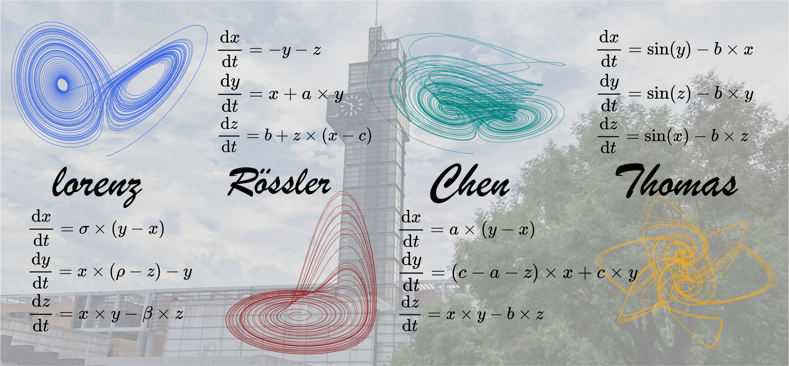

<h1 align="center">Hi , I'm whenxuan</h1>

  <a href="https://wwhenxuan.github.io/">🌐 Homepage</a> | 
  <a href="https://github.com/wwhenxuan">💻 GitHub</a> |
  <a href="mailto:whenxuan@ieee.org">📧 Email</a>

  

🔭 **About Me**: I graduated from the School of Artificial Intelligence in [Xidian University](https://www.xidian.edu.cn/) and am currently pursuing a master's degree in the School of Telecommunications Engineering.

🌱 **Research interests**: Time Series Analysis (TSA) with deep learning methods, Signal Processing, Complex System Modeling and Symbolic Regression (Scientific Discovery).

😄 **Hobbies**: About programming, photography (Nikon Z6III), videography, cycling and hiking. I think any one of them is enough to support a person to live a wonderful life.

<!--
**wwhenxuan/wwhenxuan** is a ✨ _special_ ✨ repository because its `README.md` (this file) appears on your GitHub profile.

Here are some ideas to get you started:

- 🔭 I’m currently working on ...
- 🌱 I’m currently learning ...
- 👯 I’m looking to collaborate on ...
- 🤔 I’m looking for help with ...
- 💬 Ask me about ...
- 📫 How to reach me: ...
- 😄 Pronouns: ...
- ⚡ Fun fact: ...
-->

<!--

           

-->
