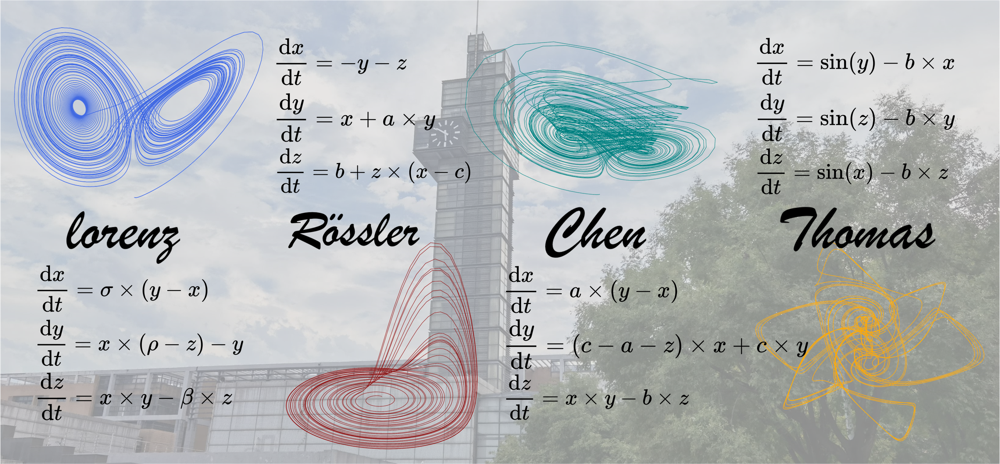

<h1 align="center">Hi , I'm whenxuan</h1>

  <a href="https://wwhenxuan.github.io/">🌐 Homepage</a> | 
  <a href="https://github.com/wwhenxuan">💻 GitHub</a> |
  <a href="mailto:whenxuan@ieee.org">📧 Email</a> |
  <a href="https://scholar.google.com/citations?user=H69ElC0AAAAJ&hl=zh-CN">🎓 Google Scholar</a>

  

🔭 **About Me**: I graduated from the School of Artificial Intelligence in [Xidian University](https://www.xidian.edu.cn/) and am currently pursuing a master's degree in the School of Telecommunications Engineering.

🌱 **Research interests**: Time Series Analysis (TSA) with deep learning methods, Modern Signal Processing, Complex System Modeling and Symbolic Regression (Scientific Discovery).

😄 **Hobbies**: About programming, photography (Nikon Z6III), videography, cycling and hiking. I think any one of them is enough to support a person to live a wonderful life.

### 🔥 News

- **[Sep. 2025]** Our paper "**[*SymTime*](https://arxiv.org/abs/2502.15466)**: Synthetic Series-Symbol Data Generation for Time Series Foundation Models" has been accepted by **NeurIPS 2025**.
- **[Aug. 2026]** Our signal decomposition library in Python: [`PySDKit`](https://github.com/wwhenxuan/PySDKit) has now released [new documentation](https://pysdkit.readthedocs.io/en/stable/index.html), which provides numerous examples of mode decomposition algorithms.
